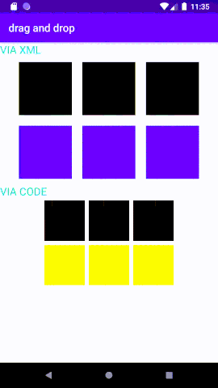

# library-android-dragdrop

#### Demo



#### Installation

###### Step 1. Add the JitPack repository to your build file
```
allprojects {
    repositories {
        maven { url 'https://jitpack.io' }
    }
}
```

###### Step 2. Add the dependency
```
dependencies {
    implementation 'com.github.thalesbm:library-android-dragdrop:1.1.1'
}
```

------

#### How to use?

###### Step 1. Implement the interface OnViewSelection
```kotlin
private val callback = object : OnViewSelection {
    // key is the destination and the value is the item
    override fun viewSelectedByTag(items: HashMap<String, String>) {
        // if set tags to views, will return the tags
    }
}
```

###### Step 2. Instance the object DraggableView
```kotlin
val draggableView = DraggableView(callback)
```

###### Step 3. Set the destinations views
```kotlin
draggableView.setDestView(...)
```

###### Step 4. Set the draggable views
```kotlin
draggableView.setDraggableView(...)
```

###### Useful Methods
```kotlin
draggableView.reset()
```
